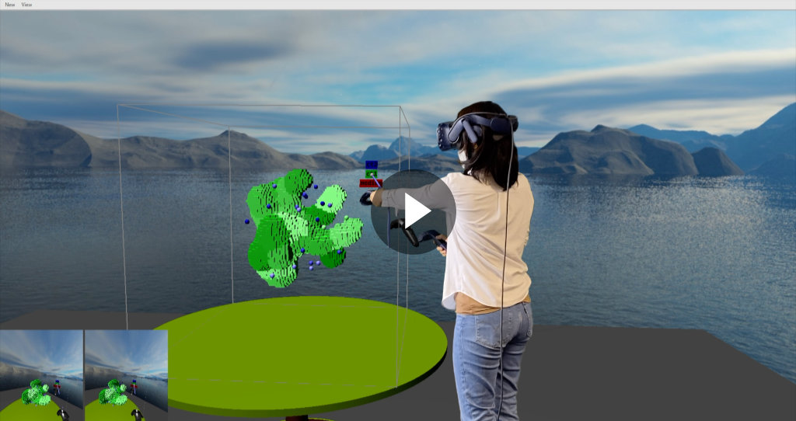

# About vr_ca_vis

**vr_ca_vis** is a Virtual Reality application for visualizing Cellular Automata simulation. It was developed as a student research project to complete a course in Master's in Computational Modeling and Simulation at TU Dresden. It uses [Computer Graphics and Visualization (CGV) framework](https://github.com/sgumhold/cgv) and has been tested on Windows 10 using HTC VIVE Pro VR headset & controllers.

The application is equipped with several features to allow exploration of cells with full depth and space perception, as well as natural and intuitive interaction. [Clipping Planes](https://github.com/taniakrisanty/vr_ca_vis/edit/main/README.md#clipping-plane) can be used for dissecting complex cell arrangement, offering cross-sectional view of the cells. [Torch](https://github.com/taniakrisanty/vr_ca_vis/edit/main/README.md#torch) tool enables peeking inside the cells. Whereas [Visibility Toggle](https://github.com/taniakrisanty/vr_ca_vis/edit/main/README.md#visibility-toggle) can be used to hide some cells, allowing for a more focused observation of certain cells. With these tools, scientists can interact with the cells just like they can with real objects.

For more complex interactions, CGV framework provides a [Virtual GUI](https://github.com/taniakrisanty/vr_ca_vis/edit/main/README.md#virtual_gui) which is a mirror of the GUI in the desktop application. It allows the user to control the GUI as if using the mouse. Through the Virtual GUI the user can change cell colors and visibilities; as well as clipping planes color, position, and orientation.

## Clipping Planes
[](https://drive.google.com/file/d/123-eLcMFY66m15jzwSWvNh1pO9uZ4rTw/view?usp=sharing)

## Torch
[](https://drive.google.com/file/d/1BV_HiimCFJ-1V5cPULg2QOc6qSBteGSx/view?usp=sharing)

## Visibility Toggle
[](https://drive.google.com/file/d/1-kkYbirovDI1-62ABfF-ONIUgSIhsz2t/view?usp=sharing)

## Virtual GUI
[](https://drive.google.com/file/d/1MM-XJnbZq5UzVZNKm4knwtGM5ME5JQIY/view?usp=sharing)


# How to run vr_ca_vis?

Before you can visualize the simulation, you need to prepare the data. Example simulation data can be downloaded [here](https://cloudstore.zih.tu-dresden.de/index.php/s/wk7bw25rBjqwtdn). The 100.zip folder contains 10 (ten) xml.gz files, each of which is a snapshot of the simulation at a particular time. Extract the zip file.

You can also generate new data by running a new simulation in [Morpheus](https://morpheus.gitlab.io/category/release). Please make sure to download and install the latest version. Download the Cell_Sorting_3D_LB4 model [here](https://cloudstore.zih.tu-dresden.de/index.php/s/jLwpyfka8jENYk2) and **Open** it in Morpheus. You can adjust how long the simulation should run and how often the snapshots should be taken under **Time** menu. **Start** the simulation and once it finishes, copy all xml.gz files in the **Output** Folder and put it in a folder.

More information on Cell Sorting model can be found [here](https://morpheus.gitlab.io/model/m0021/).

## Building vr_ca_vis

(Adapted from [cgv: Installation and Conventions - Using Internal Build System (Windows only)](https://wwwpub.zih.tu-dresden.de/~gumhold/cgv/html/install.html))

- Clone vr_ca_vis code recursively to a directory
- Duplicate vr_ca_vis/config.def and rename it into config.cgf
- Uncomment the line ```//name(vr_ca_vis):dir_name="some_directory_path"```
- Change ``some_directory_path`` into the directory path where the xml.gz simulation files are
- Create a build directory where the temporary files should be stored
- In case you want to use the x64 platform start the define_platform.bat script and follow instructions
- In case you do not want to use the most current visual studio toolset start the define_windows_sdk.bat script and follow instructions
- Use 2 explorer windows to drag build directory onto cgv/define_system_variables.bat
- Alternatively you can run the following command in the command prompt: ```define_system_variables.bat <global-path-to-build-directory>```
- Select your configuration, typically [i] for MS VS 2019
- Close the command prompt and optionally open a new to ensure that the systems variables have been updated
- Bind the extension .pj to cgv/bin/generate_makefile.bat by right clicking vr_ca_vis/vr_ca_vis.pj and finding cgv/bin/generate_makefile.bat as the default application for .pj files. This generates the solution of vr_ca_vis.
- Alternatively you can drag and drop vr_ca_vis/vr_ca_vis.pj onto cgv/bin/generate_makefile.bat
- After visual studio started, select configuration "Debug Dll" or "Release Dll"
- Ensure that vr_ca_vis is the active project
- Build solution

Once you completed these steps, you should be able to see run the application. To deploy it on VR headset, make sure you have [SteamVR](https://store.steampowered.com/about/) installed and logged in.
